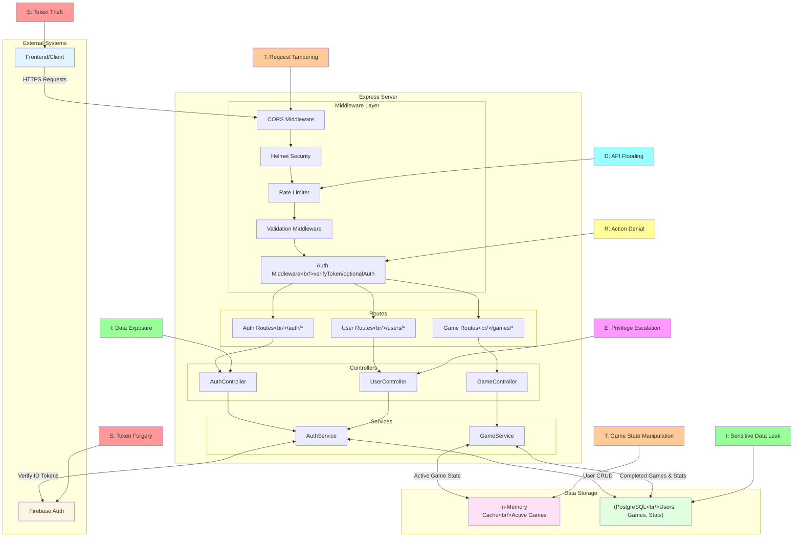

# STRIDE Threat Analysis Table

| Category | Threat | Current Mitigations | Vulnerabilities |
|----------|--------|-------------------|-----------------|
| **Spoofing** | Token Forgery/Replay Attacks | - Firebase Admin SDK verifies ID tokens cryptographically - Token format validation (JWT structure check) - Token length validation (min 100 chars) - Revoked token checking in both `verifyToken` and `optionalAuth` (`verifyIdToken(token, true)`) - Token expiration automatically validated by Firebase (checks `exp` claim) - Expired token error handling (`auth/id-token-expired`) | - No token refresh mechanism validation |
| **Spoofing** | User ID Spoofing in Game Operations | - `getActiveGame()` checks userId matches game owner for authenticated users - Session tokens required for guest games (prevents cross-guest access) - Throws error if unauthorized | - Race condition: game could be deleted between check and access - No audit logging for unauthorized access attempts |
| **Spoofing** | Email/Username Spoofing | - Email uniqueness constraint in database - Username uniqueness constraint in database - Email format validation (Zod schema) | - No email verification required - Username auto-generated from email (could conflict) - No protection against typosquatting |
| **Tampering** | Game State Manipulation | - Game state stored server-side (not client-side) - Board generation happens server-side - Cell reveal/flag operations validated server-side - Game state updates go through service layer | - Game state in memory (could be manipulated if server compromised) - No validation that revealed cells match board state - No replay protection for game actions |
| **Tampering** | Request Body/Query Parameter Tampering | - Zod schema validation on all endpoints - Type coercion and range validation (non-negative integers) - UUID validation for `gameId` - Enum validation for difficulty - Session token validation for guest games | - No validation that row/col are within board bounds - No validation that gameId exists before processing - No rate limiting per gameId (could spam actions) |
| **Tampering** | Database Tampering | - Prisma ORM provides type safety - Database transactions for atomic operations - Foreign key constraints - User ID validation in queries | - No database-level audit logging - No checksums/hashes for critical data - Direct database access could bypass application logic - No row-level security policies |
| **Tampering** | Leaderboard Data Tampering | - Rate limiting on leaderboard endpoints - Database queries use Prisma (SQL injection protection) | - No input validation on leaderboard query parameters - No caching (could be expensive to query) - No pagination limits enforced |
| **Repudiation** | Game Action Repudiation | - Game actions tied to authenticated user ID - Game state stored server-side - Completed games saved to database with timestamps - Guest games tracked with session tokens | - No audit logging for game actions - No request/response logging - No action timestamps in game cache |
| **Repudiation** | Authentication Event Repudiation | - Firebase Authentication logs events - Database timestamps (`created_at`, `updated_at`, `last_game_played`) | - No application-level audit logging - No IP address logging for auth events - No device/session tracking - No failed login attempt logging |
| **Information Disclosure** | Database Information Disclosure | - Prisma ORM prevents SQL injection - Parameterized queries - Database credentials in environment variables - User ID validation in queries | - No query result filtering (returns all user fields) - No database encryption at rest mentioned |
| **Information Disclosure** | Game State Information Disclosure | - Board only revealed on game over - Only revealed cells sent to client - Mine positions not exposed during gameplay - Game state stored server-side - Session tokens prevent unauthorized game access | - Game cache in memory (could be dumped) - No encryption for game state in transit |
| **Denial of Service** | Rate Limiting Bypass | - Rate limiting on all endpoints - Different limits for different endpoint types - IP-based rate limiting | - IP-based limiting vulnerable to IP rotation - No user-based rate limiting (only IP) |
| **Denial of Service** | Resource Exhaustion (Memory/CPU) | - Request body size limit (10MB) - Game cache cleanup (expired games removed) - Game timeout (5 minutes max duration) - Game cache expiration (2 hours) | - No limit on concurrent games per user - No limit on total games in cache - Large board sizes could consume memory |
| **Denial of Service** | Database DoS | - Prisma connection pooling - Query limits on game history - Indexed database queries (foreign keys) | - No query timeout configuration - No connection pool size limits mentioned - No database query rate limiting - No database query monitoring |
| **Denial of Service** | Authentication DoS | - Rate limiting on auth endpoints (100 requests/minute) - Firebase handles authentication - Password hashing | - Rate limit is per-IP, needs to also be per user - No account lockout after failed attempts  |
| **Elevation of Privilege** | Authorization Bypass | - Token verification middleware - User ID validation in game service for authenticated users - Session token validation for guest games - Optional auth for guest games | - No resource-level permissions |
| **Elevation of Privilege** | Privilege Escalation via Token Manipulation | - Firebase verifies token signatures - Token claims cannot be modified (cryptographically signed) - No custom claims in current implementation - Both `verifyToken` and `optionalAuth` verify token claims | |
| **Elevation of Privilege** | Database Privilege Escalation | - Prisma uses connection string (credentials in env) - Database user should have limited permissions - Prisma prevents direct SQL execution | - No verification of database user permissions - Database credentials in environment (could be exposed) - No database user role validation - Prisma migrations could be run with elevated privileges |

---

---

### Implemented
- Firebase ID token verification
- Password hashing (bcrypt)
- Input validation (Zod)
- Rate limiting
- CORS configuration
- Helmet.js security headers
- Error handling
- Game state server-side
- Database transactions
- Foreign key constraints
- Session tokens for guest games (prevents cross-guest access)
- Cryptographically secure UUIDs for game IDs

### To Be Implemented
- User-based rate limiting
- Audit logging
- Account lockout
- Email verification
- Resource limits
- Database audit logging
- Session management (for authenticated users)
- implement Redis instead of in-memory solution
